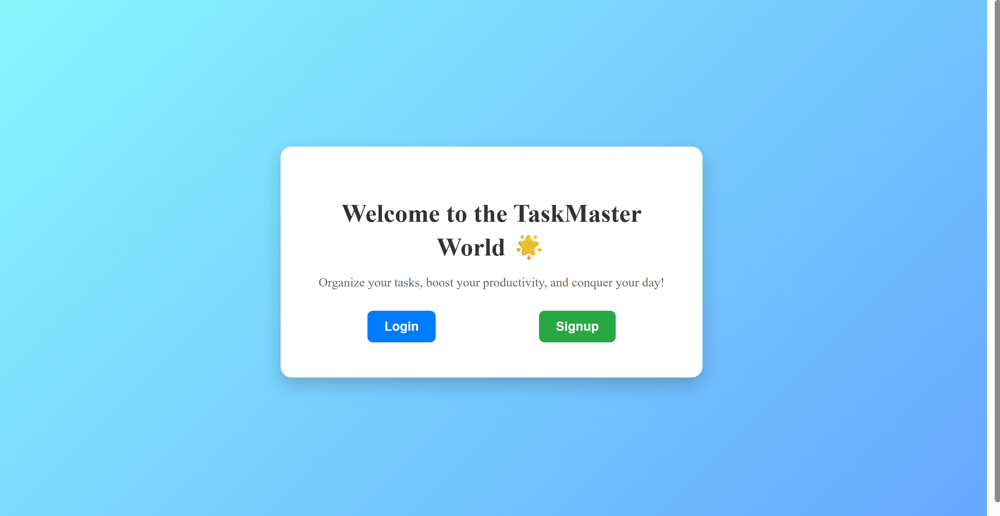

📋 TaskMaster with AWS DynamoDB, Email Verification, and Spring Boot Backend
Welcome to the TaskMaster App!
This full-stack application allows users to sign up, verify their email, log in, and manage their tasks — all built with Spring Boot, AWS DynamoDB, and React.

Features
✅ User Registration with email + password

✅ Email Verification (via SMTP)

✅ Login Authentication (only verified users can log in)

✅ Add Tasks, View Tasks, Edit Tasks, Delete Tasks

✅ Pick Custom Backgrounds for a personalized experience

✅ AWS DynamoDB is used for fast, serverless database storage

✅ Secure Passwords using BCrypt hashing

✅ Spring Boot REST API for backend

✅ React for a beautiful frontend

✅ Environment Protection (App secrets hidden, .gitignore clean)

🛠 Technologies Used
Backend	Frontend	Cloud
Spring Boot	React.js	AWS DynamoDB
Java, HTML/CSS, AWS IAM (for secure access)
Maven		SMTP (Gmail App Password)

Security
Passwords are never stored in plain text — always hashed with BCrypt.

App Secrets (SMTP passwords, AWS credentials) are moved to application-secret.properties and NOT pushed to GitHub.

Environment variables can be used for production deployments.

